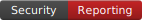

# Local Badge Usage (optional)

Replace the remote Shields.io badges in your README with these local files if you prefer no external calls.

```markdown
[](docs/ETHICS_AND_PRIVACY_POLICY.md)
[](TERMS_OF_ACCESS.md)
[](SECURITY.md)
[](docs/DISCUSSIONS_GUIDE.md)
```
